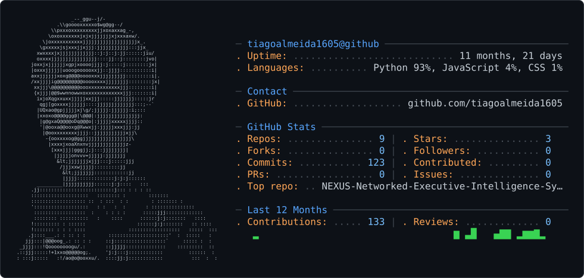

<picture>
  <source media="(prefers-color-scheme: dark)" srcset="dark_mode.svg" />
  <source media="(prefers-color-scheme: light)" srcset="light_mode.svg" />
  
</picture>

<!--
  ☝️ Card gerado automaticamente pelo gh-ascii (github.com/crafter-station/gh-ascii):
  meu avatar virando ASCII art + stats ao vivo (linguagens, repos, stars, commits),
  tudo num SVG só, sem token, sem API key.
  Ativa com o workflow .github/workflows/refresh-card.yml (já está no repo) —
  só rodar uma vez em Actions pra gerar o dark_mode.svg e o light_mode.svg.
-->

1° ano do Técnico em Informática na **UNASP São Paulo** (turma A). Curto criar interfaces, bots e automações do zero — sempre em **Linux Mint**, sempre com **Firebase** de graça. Fora do código: cristão batista, baterista nas horas vagas, torcedor do Corinthians e do Golden State Warriors.

---

### Repositórios

| Projeto | Stack | |
|---|---|---|
| **🎙️ [Rádio Geração Ativa](https://github.com/tiagoalmeida1605/Radio-Geracao-Ativa)** Site oficial da rádio estudantil do UNASP — painel admin com 3 papéis, Firebase Realtime Database + Firestore, deploy contínuo na Vercel | `HTML` `CSS` `JS` `Firebase` |  [🔊 ouvir](https://radio-geracao-ativa.vercel.app/) |
| **🤖 [NEXUS](https://github.com/tiagoalmeida1605/NEXUS-Networked-Executive-Intelligence-System-)** Um Jarvis feito por mim — assistente de terminal pra Linux Mint, core modular com sistema de plugins, update seguro com backup/rollback | `Python` |  |
| **📝 [Blog Secreto](https://github.com/tiagoalmeida1605/Blog-Secreto)** Laboratório de HTML, CSS e JS na prática — onde testo ideias antes de levar pros outros projetos | `HTML` `CSS` `JS` |  [ver blog](https://blog-secreto.vercel.app/) |

---

### Stack

---

<!--
  🐍 Snake da contribuição, versão dark — workflow .github/workflows/snake.yml
  (já está no repo, é só rodar uma vez em Actions).
-->

---

<a href="https://github.com/tiagoalmeida1605">GitHub</a> · <a href="https://radio-geracao-ativa.vercel.app/">Rádio Geração Ativa</a> · <a href="https://blog-secreto.vercel.app/">Blog Secreto</a>

🌙 vibe coding, uma linha de cada vez.
