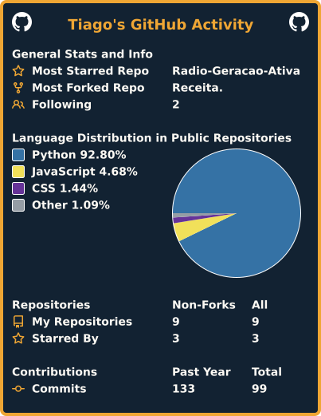

<div align="center">


<br><br>


<br>


<br>


</div>

<br>


## 🎧 Sobre mim

<i>(yes, this caption is in English — I totally got this 😎)</i>

<table width="100%">
<tr>
<td width="60%" valign="top">

- 🏫 **1° ano** do Ensino Médio Técnico em Informática — **UNASP São Paulo**, turma **A**
- 💻 Curto criar sites e ferramentas do zero, do design ao backend
- 🎙️ Mantenho o site da **[Rádio Geração Ativa](https://radio-geracao-ativa.vercel.app/)**, a rádio estudantil do UNASP
- 🤖 Desenvolvo o **NEXUS**, um assistente de terminal estilo Jarvis, em Python
- 📝 Escrevo e evoluo o **Blog Secreto**, meu laboratório de HTML/CSS/JS
- 🔥 Uso **Firebase** como backend gratuito na maioria dos projetos
- 🐧 Trabalho 100% em **Linux Mint** — nada de Windows por aqui

</td>
<td width="40%" valign="top" align="center">

```yaml
tiago:
  ano: 1° ano
  turma: A
  curso: Técnico em Informática
  escola: UNASP São Paulo
  sistema: Linux Mint 🐧
  backend_favorito: Firebase 🔥
  status: sempre_aprendendo(true)
```

</td>
</tr>
</table>

<br>

## ⚡ Além do código

<div align="center">


</div>

<br>

## 🚀 Projetos em destaque

<table width="100%">
<tr>
<td width="100%">

### 🎙️ [Rádio Geração Ativa](https://github.com/tiagoalmeida1605/Radio-Geracao-Ativa)
Site oficial da rádio estudantil do UNASP SP — meu projeto mais consistente até hoje.

- Painel admin com **3 papéis** (admin, publicador, playlist)
- Identidade visual própria, com paleta de cores por página
- Firebase Realtime Database + Firestore
- Deploy contínuo na Vercel


&nbsp;
<a href="https://radio-geracao-ativa.vercel.app/"></a>

</td>
</tr>
<tr>
<td width="100%">

### 🤖 [NEXUS — Networked Executive Intelligence System](https://github.com/tiagoalmeida1605/NEXUS-Networked-Executive-Intelligence-System-)
Um **Jarvis feito por mim, com foco em diversão** — assistente de terminal para Linux Mint, escrito em Python 3.

- `about` `doctor` `version` `update` `history` — comandos com identidade visual própria
- Core modular com sistema de plugins e carregamento dinâmico
- Config em `~/.config/nexus/` + logs com rotação automática
- Update seguro com backup e rollback
- Tema próprio **NEXUS Blue**:
    


> *"Interface evolution active."*

</td>
</tr>
<tr>
<td width="100%">

### 📝 [Blog Secreto](https://github.com/tiagoalmeida1605/Blog-Secreto)
Um espaço para testar ideias, criar projetos, experimentar novas tecnologias e evoluir como desenvolvedor.

- Laboratório de HTML, CSS e JavaScript na prática
- Layout limpo com cabeçalho, navegação e seção hero
- Roadmap: responsividade, páginas de posts, categorias, tema claro/escuro e sistema de admin


&nbsp;
<a href="https://blog-secreto.vercel.app/"></a>

> *"Todo projeto grande começa com um simples `index.html`."*

</td>
</tr>
</table>

<br>


## 🛠️ Tecnologias

<p align="left">
  
  
  
  
  
  
  
  
  
</p>

<br>

## 📊 GitHub Stats

<div align="center">

<!--
  📈 Card de stats gerado direto no repositório (sem depender de servidor externo).
  Ative com o workflow .github/workflows/stats.yml (te mandei esse arquivo) —
  suba pro repo e rode uma vez em Actions pra criar o arquivo images/userstats.svg
-->
<a href="https://github.com/cicirello/user-statistician"></a>

<br><br>


</div>

<!--
  🐍 Snake da contribuição — ative com o workflow .github/workflows/snake.yml
  (te mandei esse arquivo, é só subir pro repo e rodar uma vez em Actions)
-->
<div align="center">

</div>

<br>

<div align="center">

<a href="https://github.com/tiagoalmeida1605"></a>
<a href="https://radio-geracao-ativa.vercel.app/"></a>
<a href="https://blog-secreto.vercel.app/"></a>

<br><br>


<br>

<i>🎙️ "Sintonizando código, uma linha de cada vez."</i>


</div>'